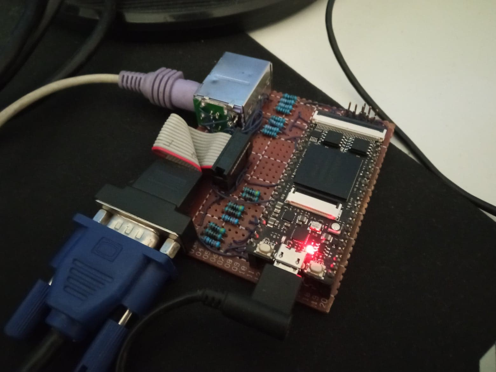

# FpChip8
Fork of the awesome FpChip8 to the Lichee Tang FPGA Board.

You need to make a custom VGA and PS2 connector for this board.

### PS2:

### VGA:

### My implementation:

For more info about FpChip8 read the orginal repo.
